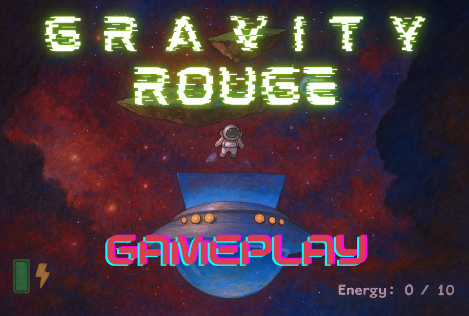

# Hi there, I'm Olaf! 👋

I'm an **M.Eng. in Aeronautical Engineering** from PUT 🎓, passionate about **Computational Fluid Dynamics**, **simulations** and **VFX**. I specialize in designing visualizations, currently exploring automation & AI.

---

## 🔨 Featured Projects

### [WingFlowLES - CFD Simulation](https://github.com/olafbielasik/WingFlowLES)  
**LES Simulation of Turbulent Flow over a Clark Y Airfoil 💨**  
- Simulates turbulent flow over a Clark Y airfoil at a -20° angle using a 600x400 stretched grid, 60,000 steps, Smagorinsky model, and IB method.
- Visualizes lift and vorticity in a **4K, 120 FPS animation** using Matplotlib, FFmpeg, Flowframes and Video2X. 📹
- Performs **9.67 trillion operations** with HPC optimization using Numba. 🧮
- **Tech Stack**: Python, NumPy, SciPy.

  

  🎥 <a href="https://www.youtube.com/watch?v=CqgccimCQGE">Watch on YouTube</a>

### [ActiveSatellitesTracker](https://github.com/olafbielasik/ActiveSatellitesTracker)  
**2D PyGame Tool to Visualize Active Satellites 🛰**  
- Visualizes active satellites in orbit using real-time TLE data and skyfield.
- Features interactive zoom, pan, and 3D-like Earth rendering.

### [HandwrittenDigitRecognizer](https://github.com/olafbielasik/HandwrittenDigitRecognizer)  
**Simple Handwritten Digit Recognizer built with PyTorch and Flask ✍️**
- It trains a neural network on the MNIST dataset and deploys it as a web application where users can draw digits on a canvas and receive real-time predictions, you can also upload your own pictures.

### [GravityRouge - 2D Game](https://github.com/olafbielasik/GravityRouge)  
**A 2D space game developed in Unity, in which you move among asteroids in a weightless state, using a jetpack and a rope to survive 🎮** 
- This project was created as a Unity 2D gameplay showcase.
- It features fully custom physics, procedural generation, grappling mechanics, jetpack fuel logic, and UI systems – built entirely from scratch.

  

  🎥 <a href="https://www.youtube.com/watch?v=E2xUcSqLpls">Watch on YouTube</a>

### [UAVSharks - web store](https://github.com/olafbielasik/UAVSharks)
**This project is a modern, single-page website template for a drone parts store, developed using HTML5, CSS3, and JavaScript 🌐**
- Features a fixed header for seamless navigation, interactive search with real-time filtering, and a dynamic shopping cart that updates instantly. 
- Includes user account management, responsive product showcases, customer reviews, team profiles, and an FAQ section—all designed to deliver an engaging and efficient e-commerce experience.

  

---

### Industry Knowledge 💡
- **Computational Fluid Dynamics (CFD)** | **Large Eddy Simulation (LES)** | **Immersed Boundary Method (IB)**
- **Turbulence Modeling** | **Aerodynamics** | **Mesh Generation** | **Numerical Analysis** | **High-Performance Computing (HPC)**
- **CAD** | **FEA** | **Airframe Structural Design** | **Design for Manufacturing**

### Tools 🛠
- **Python** (NumPy, SciPy, Matplotlib, Numba, Pygame, PyTorch, Jupyter, Anaconda, Flask)
- **MatLab** | **Octave** | **TensorFlow, Julia** | **Data Analysis & Visualization**
- **JavaScript** | **html** | **CSS** 
- **C#** | **Unity** 
- **Design & VFX**: Adobe Photoshop, Premiere Pro, InDesign, Vector Illustration, FlowFrames, DaVinci Resolve
- **SOLIDWORKS** (Flow Simulation, Visualize) | **Autodesk Software** | **OpenFOAM**
